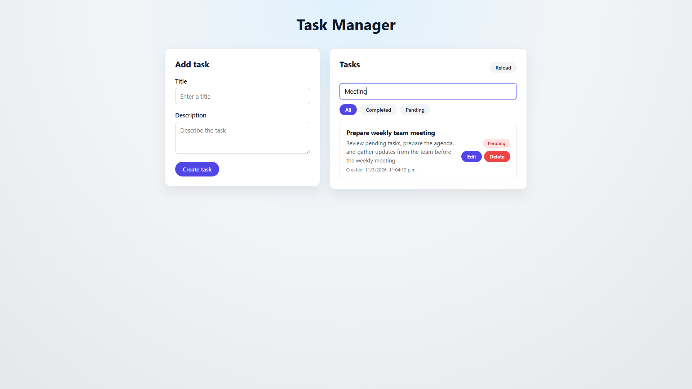
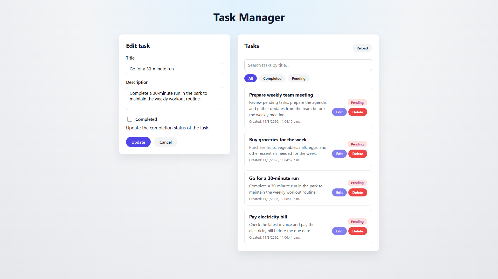

# Task Manager

A technical challenge project: a full-stack task manager with CRUD functionality. The frontend is built with **React (Vite)** and the backend with **Node.js (Express)**.

## Project description

This application allows users to create, read, update, and delete tasks. Tasks have a title, description, completion status, and creation date. The frontend communicates with a REST API and includes search by title and filters by status (all / completed / pending).

## Technologies used

- **Frontend:** React, Vite, React Router DOM, CSS
- **Backend:** Node.js, Express, CORS, dotenv
- **Storage:** In-memory array (no database)

## Installation

1. Clone the repository:

   ```bash
   git clone https://github.com/LautaroLam24/challenge-forit.git
   cd challenge-forit
   ```

2. Install backend dependencies:

   ```bash
   cd backend
   npm install
   cd ..
   ```

3. Install frontend dependencies:
   ```bash
   cd frontend
   npm install
   cd ..
   ```

## How to run the backend

From the project root:

```bash
cd backend
npm run dev
```

Or to run without nodemon:

```bash
cd backend
npm start
```

The API runs by default at `http://localhost:3000`. You can set the port with a `.env` file (e.g. `PORT=3000`).

## How to run the frontend

From the project root:

```bash
cd frontend
npm run dev
```

The app will be available at the URL shown in the terminal (usually `http://localhost:5173`). Set `VITE_API_URL` in a `.env` file if your API runs on a different URL (e.g. `VITE_API_URL=http://localhost:3000/api`).

## Features

- Create tasks
- Edit tasks
- Delete tasks
- Mark tasks as completed
- Search tasks by title
- Filter tasks (all / completed / pending)
- Form validation

## Screenshots

### Main view


### Validation (empty fields)


### Search tasks



### Edit task



## Author

**Lautaro Lamaita**

- GitHub: https://github.com/LautaroLam24
