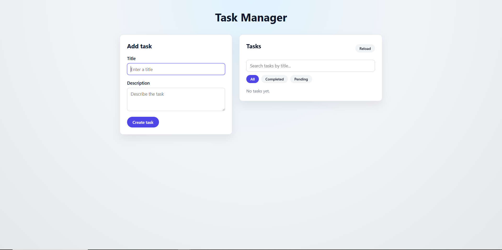
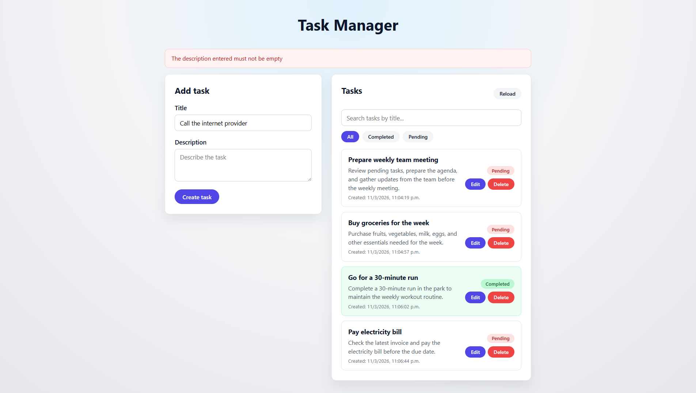

# Task Manager

A technical challenge project: a full-stack task manager with CRUD functionality. The frontend is built with **React (Vite)** and the backend with **Node.js (Express)**.

## Project description

This application allows users to create, read, update, and delete tasks. Tasks have a title, description, completion status, and creation date. The frontend communicates with a REST API and includes search by title and filters by status (all / completed / pending).

## Technologies used

- **Frontend:** React 19, Vite 7, React Router DOM, CSS
- **Backend:** Node.js, Express 5, CORS, dotenv
- **Storage:** In-memory array (no database)

## Installation

1. Clone the repository:
   ```bash
   git clone <repository-url>
   cd Challenge-ForIt
   ```

2. Install backend dependencies:
   ```bash
   cd backend
   npm install
   cd ..
   ```

3. Install frontend dependencies:
   ```bash
   cd frontend
   npm install
   cd ..
   ```

## How to run the backend

From the project root:

```bash
cd backend
npm run dev
```

Or to run without nodemon:

```bash
cd backend
npm start
```

The API runs by default at `http://localhost:3000`. You can set the port with a `.env` file (e.g. `PORT=3000`).

## How to run the frontend

From the project root:

```bash
cd frontend
npm run dev
```

The app will be available at the URL shown in the terminal (usually `http://localhost:5173`). Set `VITE_API_URL` in a `.env` file if your API runs on a different URL (e.g. `VITE_API_URL=http://localhost:3000/api`).

## Screenshots

For a good README, **2–4 screenshots** are enough: the main view plus one or two that show a clear feature (e.g. validation or filters). You don’t need one for every action.

**Suggested captures:**

| # | What to capture | Why |
|---|-----------------|-----|
| 1 | **Main view** – Full screen with "Add task" form on the left and task list on the right (search bar and All / Completed / Pending visible). | Shows the app at a glance and that CRUD + search + filters exist. |
| 2 | **Validation** – Same view with empty title/description, after clicking "Create task", with the error message visible (e.g. "The title entered must not be empty!"). | Shows backend validation is wired in the UI. |
| 3 | *(Optional)* **Edit** – Form in "Edit task" mode with a task loaded, or list with a mix of Completed/Pending so filters are obvious. | Reinforces edit flow or filter behavior. |

**How to add the images:**

1. Create a folder in the repo for images, for example `screenshots/` or `docs/images/`.
2. Save your captures there (e.g. `main-view.png`, `validation.png`).
3. Reference them in the README like this:

```markdown
### Main view


### Validation (empty title/description)

```

Use the names and paths that match your files. One main screenshot is already enough for most reviewers; the second (validation) adds clarity without overdoing it.
